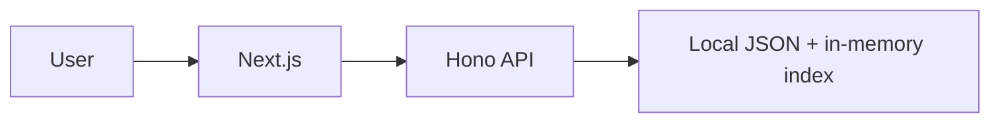

# Quran Web Application

Production-oriented full-stack app to read the Quran in the browser: **114 surahs**, **ayah pages**, **translation search**, and **persistent reading settings** (fonts and sizes). Content comes from [**risan/quran-json**](https://github.com/risan/quran-json) (English surah metadata + Saheeh International translations in the bundled dataset).

## Live demo

- **Frontend:** add your Vercel URL after deployment (see below).
- **API:** add your Render/Railway URL after deployment.

## Tech stack

| Layer    | Choice |
| -------- | ------ |
| Frontend | Next.js 15 (App Router), Tailwind CSS, `next-themes`, Zustand (persisted settings) |
| Backend  | Node.js, **Hono**, TypeScript |
| Data     | Local JSON under `backend/data` (from `quran-json` `dist/chapters/en`) |
| Tests    | Vitest (`backend`) — service + HTTP route smoke tests |

### Architecture



- **Surah list** is statically generated from `frontend/data/surahs.json` (a copy of the API/chapter index for fast SSG).
- **Ayah pages** fetch `/surah/:id` from the API (dynamic SSR; good for split deployments).
- **Search** calls `/search?q=` with a **debounced** client and highlights matches.

## Repository layout

```
backend/           # Hono REST API + JSON data
  data/
    surahs.json
    surah/*.json
  src/
    app.ts         # App factory (CORS, routes)
    server.ts      # Node entry (listen)
    services/      # Load JSON, search index
frontend/          # Next.js UI
  app/
  components/
  data/surahs.json # Static metadata for SSG list
```

## API

Base URL: `NEXT_PUBLIC_API_URL` (e.g. `http://localhost:8787`).

| Method | Path | Description |
| ------ | ---- | ----------- |
| `GET` | `/health` | Liveness |
| `GET` | `/surahs` | All surahs (metadata) |
| `GET` | `/surah/:id` | One surah with `verses` (`id` 1–114) |
| `GET` | `/search?q=` | Search ayahs by **English translation** (`includes`, normalized) |

Optional: `GET /search?limit=50` (default 120, max 200).

## Setup

### Prerequisites

- Node.js 20+
- npm

### 1. Backend

```bash
cd backend
cp .env.example .env   # optional
npm install
npm run dev            # http://localhost:8787
```

Environment:

| Variable | Default | Purpose |
| -------- | ------- | ------- |
| `PORT` | `8787` | HTTP port |
| `CORS_ORIGIN` | `http://localhost:3000` | Comma-separated allowed origins |
| `DATA_DIR` | `./data` (from compiled output) | Override JSON directory |

### 2. Frontend

```bash
cd frontend
cp .env.example .env.local
# Set NEXT_PUBLIC_API_URL to your API origin (e.g. http://localhost:8787)
npm install
npm run dev            # http://localhost:3000
```

### 3. Run both (from repo root)

```bash
npm install
npm run dev
```

### Tests

```bash
npm test
# or
cd backend && npm test
```

## Deployment

### Frontend (Vercel)

1. Import the GitHub repo; set **Root Directory** to `frontend`.
2. Environment variable: `NEXT_PUBLIC_API_URL` = your **public API URL** (https, no trailing slash).
3. Deploy. Redeploy when the API URL changes.

### Backend (Render / Railway)

1. **Root Directory:** `backend`.
2. **Build command:** `npm install && npm run build`
3. **Start command:** `npm start`
4. **Environment:**
   - `PORT` — usually provided by the platform (Render/Railway set `PORT` automatically).
   - `CORS_ORIGIN` — your Vercel site origin, e.g. `https://your-app.vercel.app` (comma-separate if multiple).

Ensure the service has the `data/` folder in the deployment artifact (it lives in the repo under `backend/data`).

### CORS & incognito

- Open the deployed site in a **private window** to verify no stale cookies; settings use **localStorage** only.
- If the browser blocks requests, check `CORS_ORIGIN` matches the exact scheme + host of the frontend.

## Features

- Surah list with Arabic + English names; meccan/medinan badge
- Ayah view: Arabic, English translation, transliteration; anchor links from search (`/surah/2#2-255`)
- Translation search with highlight
- Settings: Arabic font (Amiri / Scheherazade New), Arabic size, translation size (persisted)
- Dark mode toggle (bonus)
- Debounced search (bonus)

## Data source

JSON is from [**risan/quran-json**](https://github.com/risan/quran-json) (`dist/chapters/en/index.json` → `surahs.json`, `dist/chapters/en/{n}.json` → `surah/{n}.json`).  
Fallback public APIs (alquran.cloud, etc.) are **not** wired in code; the app is designed to run fully offline against bundled files.

## License

Project code: MIT (add a `LICENSE` file if you need a formal statement).  
Quran text and translations: see attributions in [risan/quran-json](https://github.com/risan/quran-json).
